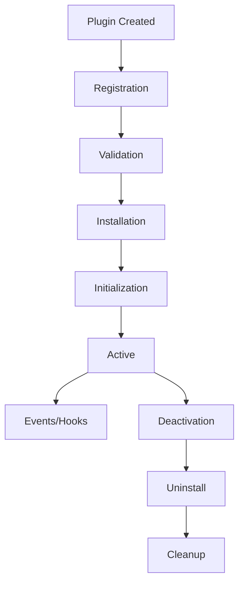

# 🔌 Plugin Development Guide - Extending the Neural Universe

*Transform LLM-Runner-Router into your personal AI orchestration masterpiece*

## Table of Contents
- [Plugin Architecture](#plugin-architecture)
- [Creating Your First Plugin](#creating-your-first-plugin)
- [Plugin Types](#plugin-types)
- [Hook System](#hook-system)
- [Loader Plugins](#loader-plugins)
- [Engine Plugins](#engine-plugins)
- [Router Strategy Plugins](#router-strategy-plugins)
- [Middleware Plugins](#middleware-plugins)
- [Publishing Plugins](#publishing-plugins)
- [Best Practices](#best-practices)

## Plugin Architecture

### The Extension Philosophy

Plugins in LLM-Runner-Router aren't just add-ons - they're first-class citizens that can fundamentally alter the system's behavior. Every core component is designed to be extended, replaced, or enhanced.

```javascript
// The plugin system in action
const myPlugin = {
  name: 'my-awesome-plugin',
  version: '1.0.0',
  type: 'loader',
  
  async install(router) {
    // Your plugin logic here
    router.on('model-load', this.handleLoad);
    router.registry.registerLoader('myformat', this.loader);
  },
  
  async uninstall(router) {
    // Cleanup
    router.off('model-load', this.handleLoad);
  }
};

router.use(myPlugin);
```

### Plugin Lifecycle



## Creating Your First Plugin

### Basic Plugin Structure

```javascript
// my-plugin.js
export class MyPlugin {
  constructor(options = {}) {
    this.name = 'my-plugin';
    this.version = '1.0.0';
    this.type = 'enhancement';
    this.options = options;
    this.router = null;
  }
  
  // Called when plugin is installed
  async install(router) {
    this.router = router;
    console.log(`🔌 ${this.name} installing...`);
    
    // Add your functionality
    this.setupHooks();
    this.registerComponents();
    this.initializeServices();
    
    console.log(`✅ ${this.name} installed!`);
  }
  
  // Setup event listeners
  setupHooks() {
    this.router.on('inference-start', this.onInferenceStart.bind(this));
    this.router.on('inference-complete', this.onInferenceComplete.bind(this));
  }
  
  // Register custom components
  registerComponents() {
    // Add custom loader, engine, or strategy
  }
  
  // Initialize any services
  async initializeServices() {
    // Setup databases, connections, etc.
  }
  
  // Event handlers
  async onInferenceStart(context) {
    console.log('Inference starting:', context);
  }
  
  async onInferenceComplete(result) {
    console.log('Inference complete:', result);
  }
  
  // Called when plugin is uninstalled
  async uninstall() {
    console.log(`🔌 ${this.name} uninstalling...`);
    
    // Cleanup
    this.router.off('inference-start', this.onInferenceStart);
    this.router.off('inference-complete', this.onInferenceComplete);
    
    console.log(`✅ ${this.name} uninstalled!`);
  }
}

export default MyPlugin;
```

### Using Your Plugin

```javascript
import LLMRouter from 'llm-runner-router';
import MyPlugin from './my-plugin.js';

const router = new LLMRouter();
const plugin = new MyPlugin({
  customOption: 'value'
});

// Install the plugin
await router.use(plugin);

// Plugin is now active!
```

## Plugin Types

### 1. Loader Plugins

Add support for new model formats.

```javascript
export class CustomFormatLoader {
  static name = 'custom-loader';
  static type = 'loader';
  static format = 'customformat';
  static extensions = ['.custom', '.cst'];
  
  async install(router) {
    router.registry.registerLoader(this.format, this);
  }
  
  async canLoad(path) {
    return this.extensions.some(ext => path.endsWith(ext));
  }
  
  async load(spec) {
    console.log(`Loading custom format from: ${spec.source}`);
    
    // Parse your custom format
    const data = await this.parseCustomFormat(spec.source);
    
    // Create model instance
    return new CustomModel(data);
  }
  
  async parseCustomFormat(source) {
    // Your parsing logic
    const fileContent = await fs.readFile(source);
    return this.decode(fileContent);
  }
  
  decode(buffer) {
    // Decode your format
    return {
      weights: ...,
      config: ...,
      metadata: ...
    };
  }
}
```

### 2. Engine Plugins

Add new inference backends.

```javascript
export class CustomEngine extends BaseEngine {
  static name = 'custom-engine';
  static type = 'engine';
  
  constructor() {
    super('custom');
    this.capabilities = {
      parallel: true,
      gpu: true,
      streaming: true,
      quantization: false
    };
  }
  
  async install(router) {
    router.engines.register(this.name, this);
  }
  
  async isSupported() {
    // Check if your engine can run
    return typeof CustomAPI !== 'undefined';
  }
  
  async initialize(options) {
    console.log('Initializing custom engine...');
    this.api = new CustomAPI(options);
    this.initialized = true;
  }
  
  async execute(model, input, options) {
    // Your inference logic
    const result = await this.api.infer(model, input);
    return this.processResult(result);
  }
  
  processResult(raw) {
    // Format the result
    return {
      text: raw.output,
      tokens: raw.tokenCount,
      latency: raw.processingTime
    };
  }
}
```

### 3. Router Strategy Plugins

Create custom routing strategies.

```javascript
export class SmartRouter {
  static name = 'smart-router';
  static type = 'strategy';
  
  async install(router) {
    router.addStrategy('smart', this.route.bind(this));
  }
  
  async route(models, context) {
    console.log('Smart routing activated!');
    
    // Analyze context
    const analysis = this.analyzeContext(context);
    
    // Score models
    const scores = await Promise.all(
      models.map(model => this.scoreModel(model, analysis))
    );
    
    // Select best model
    const best = scores.reduce((best, current) => 
      current.score > best.score ? current : best
    );
    
    return best.model;
  }
  
  analyzeContext(context) {
    return {
      complexity: this.measureComplexity(context.prompt),
      domain: this.detectDomain(context.prompt),
      urgency: context.priority || 'normal',
      constraints: context.requirements || {}
    };
  }
  
  async scoreModel(model, analysis) {
    let score = 0;
    
    // Domain expertise
    if (model.domains?.includes(analysis.domain)) {
      score += 10;
    }
    
    // Complexity handling
    if (analysis.complexity > 0.7 && model.parameters?.size > 10e9) {
      score += 5;
    }
    
    // Speed for urgent requests
    if (analysis.urgency === 'high' && model.metrics?.avgLatency < 100) {
      score += 8;
    }
    
    return { model, score };
  }
  
  measureComplexity(prompt) {
    // Simple complexity heuristic
    const factors = {
      length: prompt.length / 1000,
      sentences: prompt.split('.').length / 10,
      techTerms: (prompt.match(/\b(algorithm|neural|quantum)\b/gi) || []).length / 5
    };
    
    return Math.min(1, Object.values(factors).reduce((a, b) => a + b) / 3);
  }
  
  detectDomain(prompt) {
    const domains = {
      code: /\b(code|function|debug|implement)\b/i,
      math: /\b(calculate|equation|solve|integral)\b/i,
      creative: /\b(story|poem|write|imagine)\b/i,
      business: /\b(revenue|strategy|market|customer)\b/i
    };
    
    for (const [domain, pattern] of Object.entries(domains)) {
      if (pattern.test(prompt)) return domain;
    }
    
    return 'general';
  }
}
```

### 4. Middleware Plugins

Intercept and modify the inference pipeline.

```javascript
export class LoggingMiddleware {
  static name = 'logging-middleware';
  static type = 'middleware';
  
  async install(router) {
    router.use(this.middleware.bind(this));
  }
  
  async middleware(context, next) {
    console.log('📝 Request:', {
      prompt: context.prompt.substring(0, 50) + '...',
      model: context.model,
      timestamp: new Date()
    });
    
    const startTime = Date.now();
    
    try {
      // Call next middleware/handler
      const result = await next();
      
      console.log('✅ Response:', {
        model: result.model,
        tokens: result.tokens,
        latency: Date.now() - startTime
      });
      
      // Optionally modify result
      result.logged = true;
      
      return result;
    } catch (error) {
      console.error('❌ Error:', error);
      throw error;
    }
  }
}
```

## Hook System

### Available Hooks

```javascript
// Lifecycle hooks
router.on('initialized', () => {});
router.on('cleanup', () => {});

// Model hooks
router.on('model-loading', (model) => {});
router.on('model-loaded', (model) => {});
router.on('model-unloaded', (model) => {});
router.on('model-error', (error) => {});

// Inference hooks
router.on('inference-start', (context) => {});
router.on('inference-progress', (progress) => {});
router.on('inference-complete', (result) => {});
router.on('inference-error', (error) => {});

// Routing hooks
router.on('route-start', (models) => {});
router.on('route-selected', (model) => {});
router.on('strategy-changed', (strategy) => {});

// Cache hooks
router.on('cache-hit', (key) => {});
router.on('cache-miss', (key) => {});
router.on('cache-set', (key, value) => {});
```

### Creating Custom Hooks

```javascript
export class CustomHookPlugin {
  async install(router) {
    // Add new hook type
    router.addHookType('custom-event');
    
    // Listen to custom hook
    router.on('custom-event', (data) => {
      console.log('Custom event triggered:', data);
    });
    
    // Trigger custom hook elsewhere
    router.emit('custom-event', { custom: 'data' });
  }
}
```

## Advanced Plugin Patterns

### Dependency Management

```javascript
export class DependentPlugin {
  static name = 'dependent-plugin';
  static dependencies = ['required-plugin', 'another-plugin'];
  
  async install(router) {
    // Check dependencies
    for (const dep of this.constructor.dependencies) {
      if (!router.hasPlugin(dep)) {
        throw new Error(`Missing dependency: ${dep}`);
      }
    }
    
    // Safe to proceed
    this.setup(router);
  }
}
```

### Configuration Schema

```javascript
export class ConfigurablePlugin {
  static configSchema = {
    type: 'object',
    properties: {
      apiKey: { type: 'string', required: true },
      endpoint: { type: 'string', default: 'https://api.example.com' },
      timeout: { type: 'number', default: 5000 },
      retries: { type: 'number', default: 3 }
    }
  };
  
  constructor(config) {
    this.config = this.validateConfig(config);
  }
  
  validateConfig(config) {
    // Validate against schema
    // ... validation logic
    return config;
  }
}
```

### State Management

```javascript
export class StatefulPlugin {
  constructor() {
    this.state = {
      requestCount: 0,
      errorCount: 0,
      lastRequest: null
    };
  }
  
  async install(router) {
    // Persist state
    await this.loadState();
    
    // Update state on events
    router.on('inference-complete', () => {
      this.state.requestCount++;
      this.state.lastRequest = Date.now();
      this.saveState();
    });
  }
  
  async loadState() {
    try {
      const saved = await fs.readFile('.plugin-state.json');
      this.state = JSON.parse(saved);
    } catch {
      // Use default state
    }
  }
  
  async saveState() {
    await fs.writeFile('.plugin-state.json', JSON.stringify(this.state));
  }
}
```

## Publishing Plugins

### Package Structure

```
my-llm-plugin/
├── package.json
├── README.md
├── LICENSE
├── src/
│   ├── index.js        # Main plugin file
│   ├── loader.js       # Custom loader
│   ├── engine.js       # Custom engine
│   └── utils.js        # Utilities
├── test/
│   └── plugin.test.js  # Tests
└── examples/
    └── usage.js        # Usage examples
```

### Package.json

```json
{
  "name": "llm-router-plugin-myawesome",
  "version": "1.0.0",
  "description": "Awesome plugin for LLM-Runner-Router",
  "main": "src/index.js",
  "keywords": [
    "llm-runner-router",
    "plugin",
    "ai",
    "llm"
  ],
  "peerDependencies": {
    "llm-runner-router": "^1.0.0"
  },
  "llmRouter": {
    "type": "enhancement",
    "compatible": "^1.0.0",
    "features": ["custom-format", "new-engine"]
  }
}
```

### Publishing to NPM

```bash
# Build and test
npm run build
npm test

# Publish
npm publish

# Users can then install
npm install llm-router-plugin-myawesome
```

## Best Practices

### 1. Error Handling

```javascript
export class RobustPlugin {
  async install(router) {
    try {
      await this.riskyOperation();
    } catch (error) {
      console.error(`Plugin error: ${error.message}`);
      // Graceful degradation
      this.fallbackMode = true;
    }
  }
  
  async riskyOperation() {
    // Always wrap risky operations
    if (!this.checkPreconditions()) {
      throw new Error('Preconditions not met');
    }
    // ... operation
  }
}
```

### 2. Performance Considerations

```javascript
export class PerformantPlugin {
  constructor() {
    // Cache expensive operations
    this.cache = new Map();
    
    // Debounce frequent operations
    this.debouncedSave = this.debounce(this.save, 1000);
  }
  
  async process(data) {
    // Check cache first
    if (this.cache.has(data.id)) {
      return this.cache.get(data.id);
    }
    
    // Expensive operation
    const result = await this.expensiveOperation(data);
    
    // Cache result
    this.cache.set(data.id, result);
    
    return result;
  }
  
  debounce(fn, delay) {
    let timeout;
    return (...args) => {
      clearTimeout(timeout);
      timeout = setTimeout(() => fn.apply(this, args), delay);
    };
  }
}
```

### 3. Testing Plugins

```javascript
// test/plugin.test.js
import { describe, test, expect } from '@jest/globals';
import LLMRouter from 'llm-runner-router';
import MyPlugin from '../src/index.js';

describe('MyPlugin', () => {
  let router;
  let plugin;
  
  beforeEach(async () => {
    router = new LLMRouter();
    plugin = new MyPlugin();
    await router.use(plugin);
  });
  
  test('should install correctly', () => {
    expect(router.hasPlugin('my-plugin')).toBe(true);
  });
  
  test('should handle inference', async () => {
    const result = await router.quick('test prompt');
    expect(result).toHaveProperty('logged', true);
  });
  
  afterEach(async () => {
    await router.cleanup();
  });
});
```

### 4. Documentation

```javascript
/**
 * MyAwesomePlugin - Adds awesome functionality to LLM-Runner-Router
 * 
 * @example
 * ```javascript
 * import MyAwesomePlugin from 'llm-router-plugin-awesome';
 * 
 * const plugin = new MyAwesomePlugin({
 *   apiKey: 'your-key',
 *   mode: 'turbo'
 * });
 * 
 * router.use(plugin);
 * ```
 * 
 * @param {Object} options - Plugin configuration
 * @param {string} options.apiKey - API key for external service
 * @param {string} [options.mode='normal'] - Operation mode
 */
export class MyAwesomePlugin {
  // ... implementation
}
```

## Plugin Gallery

### Official Plugins

- `llm-router-plugin-cache-redis` - Redis caching
- `llm-router-plugin-metrics-prometheus` - Prometheus metrics
- `llm-router-plugin-auth-jwt` - JWT authentication
- `llm-router-plugin-rate-limit` - Rate limiting

### Community Plugins

- `llm-router-plugin-langchain` - LangChain integration
- `llm-router-plugin-vector-store` - Vector database support
- `llm-router-plugin-fine-tune` - Fine-tuning support
- `llm-router-plugin-ui-dashboard` - Web dashboard

---

*Plugins are the synapses that connect your imagination to reality. Build freely, extend boldly!* 🚀

Built with 💙 by Echo AI Systems
