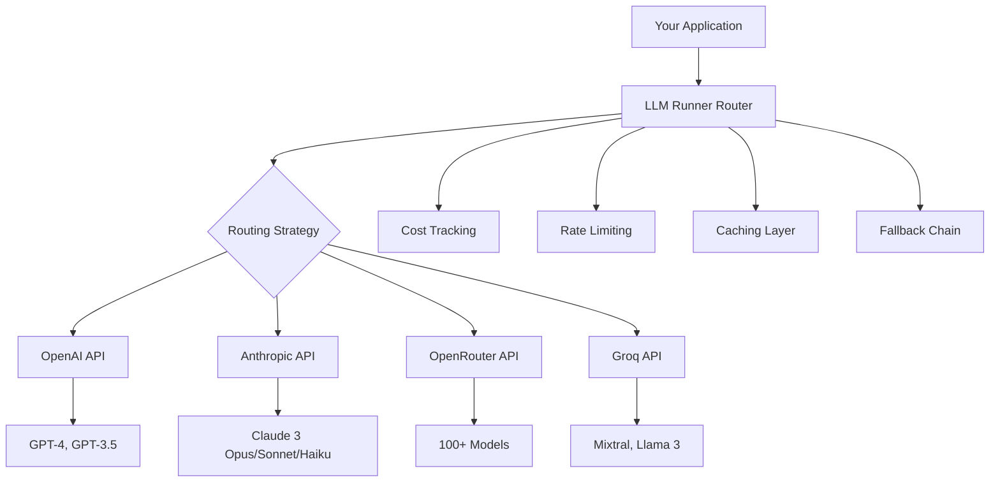

# 📚 API Providers Introduction

## What are API Providers in LLM-Runner-Router?

API providers in LLM-Runner-Router offer a unified interface to access leading AI model services including OpenAI, Anthropic (Claude), OpenRouter, and Groq. This abstraction layer enables seamless switching between providers, automatic fallback handling, and intelligent routing based on your requirements.

## Key Benefits

### 🎯 Unified Interface
- Single API for all providers
- Consistent request/response format
- No vendor lock-in
- Easy provider switching

### 💰 Cost Management
- Real-time cost tracking
- Budget constraints
- Cost-optimized routing
- Provider price comparison

### ⚡ Performance Optimization
- Automatic rate limiting
- Intelligent retry logic
- Response caching
- Load balancing

### 🔄 Reliability
- Automatic fallback chains
- Error recovery
- Provider health monitoring
- Queue management

## Comparison: API vs Local Models

| Feature | API Models | Local Models |
|---------|------------|--------------|
| **Setup Complexity** | ✅ Simple (API key only) | ⚠️ Complex (download, hardware) |
| **Initial Cost** | ✅ Pay-per-use | ❌ Hardware investment |
| **Scalability** | ✅ Unlimited | ⚠️ Hardware limited |
| **Latency** | ⚠️ Network dependent | ✅ Low latency |
| **Privacy** | ⚠️ Data leaves premises | ✅ Full control |
| **Model Selection** | ✅ Latest models | ⚠️ Limited by hardware |
| **Maintenance** | ✅ Provider managed | ❌ Self-managed |
| **Internet Required** | ❌ Yes | ✅ No |

## When to Use API Providers

### ✅ API Providers are Ideal for:
- **Rapid Prototyping**: Start immediately without setup
- **Variable Workloads**: Scale up/down as needed
- **Latest Models**: Access GPT-4, Claude 3, etc.
- **Limited Resources**: No GPU/hardware required
- **Multi-Model Apps**: Switch models dynamically
- **Cost Flexibility**: Pay only for usage

### ❌ Consider Local Models for:
- **High Volume**: Consistent heavy usage
- **Data Privacy**: Sensitive data processing
- **Offline Requirements**: No internet dependency
- **Low Latency**: Microsecond response times
- **Custom Models**: Fine-tuned or proprietary models

## Cost-Benefit Analysis

### API Provider Costs (Monthly Estimates)

| Usage Level | Tokens/Month | OpenAI GPT-4 | Claude 3 Opus | Local GPU |
|-------------|--------------|--------------|---------------|-----------|
| **Light** | 100K | ~$3 | ~$1.50 | $500+ (hardware) |
| **Medium** | 1M | ~$30 | ~$15 | $500+ (hardware) |
| **Heavy** | 10M | ~$300 | ~$150 | $500+ (hardware) |
| **Enterprise** | 100M+ | ~$3,000+ | ~$1,500+ | $2,000+ (hardware) |

### Break-Even Analysis
- **Light users**: API providers are 100x more cost-effective
- **Medium users**: APIs remain cheaper for first 12-18 months
- **Heavy users**: Consider hybrid approach
- **Enterprise**: Custom pricing negotiations available

## Performance Characteristics

### Response Times
```
API Providers:
├─ First Token: 200-500ms (network + processing)
├─ Streaming: 20-100 tokens/sec
└─ Total Latency: 1-5 seconds typical

Local Models:
├─ First Token: 10-100ms (no network)
├─ Streaming: 10-50 tokens/sec (hardware dependent)
└─ Total Latency: 0.5-3 seconds typical
```

### Throughput Comparison
| Provider | Tokens/Second | Requests/Minute | Concurrent Requests |
|----------|---------------|-----------------|---------------------|
| OpenAI GPT-4 | 20-50 | 3-20 (tier based) | 50-500 |
| Anthropic Claude | 30-60 | 5-50 (tier based) | 100-1000 |
| Groq (LPU) | 100-300+ | 30-100 | 100-500 |
| OpenRouter | Varies | Model dependent | 100-1000 |
| Local (RTX 4090) | 20-40 | Unlimited | Hardware limited |

## Architecture Overview



## Quick Example

```javascript
import { APILoader } from 'llm-runner-router';

// Initialize with automatic provider detection
const ai = new APILoader({
  provider: 'auto',  // Automatically selects best provider
  apiKeys: {
    openai: process.env.OPENAI_API_KEY,
    anthropic: process.env.ANTHROPIC_API_KEY,
    openrouter: process.env.OPENROUTER_API_KEY,
    groq: process.env.GROQ_API_KEY
  },
  strategy: 'balanced'  // Balance cost, quality, and speed
});

// Simple completion
const response = await ai.complete({
  prompt: "Explain quantum computing",
  maxTokens: 200
});

console.log(response.text);
console.log(`Cost: $${response.cost.toFixed(4)}`);
console.log(`Provider: ${response.provider}`);
```

## Next Steps

1. **[Quick Start Guide](./quickstart.md)** - Get running in 5 minutes
2. **[Provider Setup](./providers/)** - Configure your preferred providers
3. **[API Reference](./reference/)** - Complete method documentation
4. **[Best Practices](./tutorials/best-practices.md)** - Production tips

## Security Considerations

### API Key Management
- Never commit API keys to version control
- Use environment variables or secure vaults
- Rotate keys regularly
- Monitor usage for anomalies

### Data Privacy
- Understand provider data policies
- Consider data residency requirements
- Implement request/response logging
- Use encryption for sensitive data

### Rate Limiting
- Implement client-side rate limiting
- Monitor quota usage
- Set up alerts for limits
- Plan for rate limit errors

## Support & Resources

- 📖 [Complete Documentation](../index.md)
- 💬 [GitHub Discussions](https://github.com/MCERQUA/LLM-Runner-Router/discussions)
- 🐛 [Issue Tracker](https://github.com/MCERQUA/LLM-Runner-Router/issues)
- 📦 [NPM Package](https://www.npmjs.com/package/llm-runner-router)