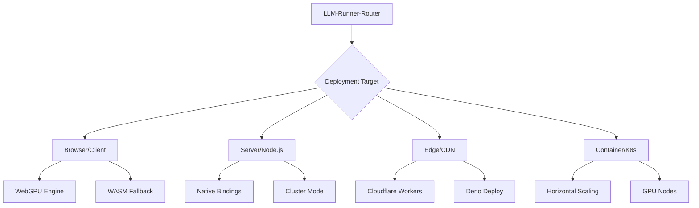

# 🚀 Deployment Guide - Launch Your Neural Fleet

*From development dimension to production paradise - your complete deployment manifesto*

## Table of Contents
- [Deployment Strategies](#deployment-strategies)
- [Environment Setup](#environment-setup)
- [Browser Deployment](#browser-deployment)
- [Node.js Server](#nodejs-server)
- [Edge Computing](#edge-computing)
- [Docker Deployment](#docker-deployment)
- [Kubernetes Orchestration](#kubernetes-orchestration)
- [CI/CD Pipeline](#cicd-pipeline)
- [Monitoring & Observability](#monitoring--observability)
- [Performance Tuning](#performance-tuning)

## Deployment Strategies

### Choose Your Destiny



### Quick Decision Matrix

| Scenario | Recommended Deployment | Engine | Scale |
|----------|----------------------|---------|--------|
| Privacy-first app | Browser | WebGPU/WASM | Per-user |
| API Service | Node.js Server | Native | Vertical |
| Global Low-latency | Edge Workers | WASM | Geographic |
| High-throughput | Kubernetes | Mixed | Horizontal |
| Development | Local Docker | Any | Single |

## Environment Setup

### Prerequisites Check

```bash
# Check your dimensional readiness
node --version  # >= 18.0.0
npm --version   # >= 9.0.0
git --version   # >= 2.0.0

# Optional but recommended
docker --version  # For containerization
kubectl version   # For Kubernetes
```

### Installation

```bash
# Clone the quantum repository
git clone https://github.com/echoaisystems/llm-runner-router
cd llm-runner-router

# Install dependencies
npm install

# Build for production
npm run build

# Run tests (always test in production dimension!)
npm test
```

### Environment Variables

Create `.env` file for your deployment:

```env
# Core Configuration
NODE_ENV=production
LOG_LEVEL=info
PORT=3006

# Model Settings
MODEL_REGISTRY_PATH=/var/lib/llm-router/registry.json
MODEL_CACHE_PATH=/var/lib/llm-router/cache
MAX_MODELS=50

# Performance
MAX_CONCURRENCY=10
CACHE_TTL=3600000
ENABLE_METRICS=true

# Security
ENABLE_AUTH=true
API_KEY=your-secret-key-here
CORS_ORIGINS=https://yourdomain.com

# Monitoring
TELEMETRY_ENDPOINT=https://telemetry.yourservice.com
SENTRY_DSN=your-sentry-dsn
```

## Browser Deployment

### Webpack Configuration

```javascript
// webpack.config.js
module.exports = {
  entry: './src/index.js',
  output: {
    filename: 'llm-router.min.js',
    library: 'LLMRouter',
    libraryTarget: 'umd'
  },
  module: {
    rules: [
      {
        test: /\.js$/,
        exclude: /node_modules/,
        use: 'babel-loader'
      },
      {
        test: /\.wasm$/,
        type: 'asset/resource'
      }
    ]
  },
  optimization: {
    minimize: true,
    splitChunks: {
      chunks: 'all'
    }
  }
};
```

### HTML Integration

```html
<!DOCTYPE html>
<html>
<head>
  <script src="llm-router.min.js"></script>
</head>
<body>
  <script>
    // Initialize in browser
    const router = new LLMRouter({
      preferredEngine: 'webgpu',
      fallbackEngine: 'wasm',
      modelSource: 'https://models.cdn.com/'
    });
    
    // Load model from CDN
    router.load('llama-7b.gguf').then(model => {
      console.log('Model ready in browser!');
    });
  </script>
</body>
</html>
```

### Service Worker Cache

```javascript
// sw.js - Service Worker for offline models
self.addEventListener('install', event => {
  event.waitUntil(
    caches.open('llm-models-v1').then(cache => {
      return cache.addAll([
        '/models/llama-7b.gguf',
        '/wasm/inference.wasm'
      ]);
    })
  );
});

self.addEventListener('fetch', event => {
  if (event.request.url.includes('/models/')) {
    event.respondWith(
      caches.match(event.request).then(response => {
        return response || fetch(event.request);
      })
    );
  }
});
```

## Node.js Server

### Express Integration

```javascript
// server.js
import express from 'express';
import LLMRouter from 'llm-runner-router';

const app = express();
const router = new LLMRouter({
  preferredEngine: 'node',
  modelRegistry: './models/registry.json'
});

// Initialize router
await router.initialize();

// API endpoint
app.post('/api/inference', async (req, res) => {
  try {
    const { prompt, options } = req.body;
    const response = await router.quick(prompt, options);
    res.json(response);
  } catch (error) {
    res.status(500).json({ error: error.message });
  }
});

// Streaming endpoint
app.post('/api/stream', (req, res) => {
  res.setHeader('Content-Type', 'text/event-stream');
  res.setHeader('Cache-Control', 'no-cache');
  
  const stream = router.stream(req.body.prompt);
  
  for await (const token of stream) {
    res.write(`data: ${JSON.stringify({ token })}\n\n`);
  }
  
  res.end();
});

app.listen(3006, () => {
  console.log('🚀 LLM Router serving on port 3006');
});
```

### PM2 Configuration

```javascript
// ecosystem.config.js
module.exports = {
  apps: [{
    name: 'llm-router',
    script: './server.js',
    instances: 'max',
    exec_mode: 'cluster',
    env: {
      NODE_ENV: 'production',
      PORT: 3006
    },
    error_file: './logs/error.log',
    out_file: './logs/out.log',
    merge_logs: true,
    max_memory_restart: '4G'
  }]
};
```

### Systemd Service

```ini
# /etc/systemd/system/llm-router.service
[Unit]
Description=LLM Router Service
After=network.target

[Service]
Type=simple
User=llmrouter
WorkingDirectory=/opt/llm-router
ExecStart=/usr/bin/node server.js
Restart=on-failure
RestartSec=10
StandardOutput=syslog
StandardError=syslog
SyslogIdentifier=llm-router

[Install]
WantedBy=multi-user.target
```

## Edge Computing

### Cloudflare Workers

```javascript
// worker.js
import LLMRouter from 'llm-runner-router';

const router = new LLMRouter({
  preferredEngine: 'wasm',
  modelSource: 'https://r2.cloudflarestorage.com/models/'
});

export default {
  async fetch(request, env, ctx) {
    // Initialize on first request
    if (!router.initialized) {
      await router.initialize();
    }
    
    const { prompt } = await request.json();
    const response = await router.quick(prompt);
    
    return new Response(JSON.stringify(response), {
      headers: { 'Content-Type': 'application/json' }
    });
  }
};
```

### Deno Deploy

```typescript
// deno-server.ts
import { serve } from "https://deno.land/std@0.140.0/http/server.ts";
import LLMRouter from "./llm-router.js";

const router = new LLMRouter({
  preferredEngine: 'wasm'
});

await router.initialize();

serve(async (req) => {
  const { prompt } = await req.json();
  const response = await router.quick(prompt);
  
  return new Response(JSON.stringify(response), {
    headers: { "Content-Type": "application/json" }
  });
});
```

## Docker Deployment

### Dockerfile

```dockerfile
# Multi-stage build for optimization
FROM node:20-alpine AS builder

WORKDIR /app
COPY package*.json ./
RUN npm ci --only=production

COPY . .
RUN npm run build

# Production stage
FROM node:20-alpine

RUN apk add --no-cache tini
WORKDIR /app

COPY --from=builder /app/dist ./dist
COPY --from=builder /app/node_modules ./node_modules
COPY --from=builder /app/package.json ./

# Create non-root user
RUN addgroup -g 1001 -S nodejs && \
    adduser -S nodejs -u 1001

# Model cache directory
RUN mkdir -p /var/lib/llm-router && \
    chown -R nodejs:nodejs /var/lib/llm-router

USER nodejs

EXPOSE 3006
ENTRYPOINT ["/sbin/tini", "--"]
CMD ["node", "dist/server.js"]
```

### Docker Compose

```yaml
version: '3.8'

services:
  llm-router:
    build: .
    ports:
      - "3006:3006"
    volumes:
      - model-cache:/var/lib/llm-router
      - ./config:/app/config
    environment:
      - NODE_ENV=production
      - LOG_LEVEL=info
    deploy:
      replicas: 3
      resources:
        limits:
          cpus: '2'
          memory: 4G
        reservations:
          cpus: '1'
          memory: 2G
    healthcheck:
      test: ["CMD", "curl", "-f", "http://localhost:3006/health"]
      interval: 30s
      timeout: 10s
      retries: 3

  nginx:
    image: nginx:alpine
    ports:
      - "80:80"
      - "443:443"
    volumes:
      - ./nginx.conf:/etc/nginx/nginx.conf
      - ./certs:/etc/nginx/certs
    depends_on:
      - llm-router

volumes:
  model-cache:
```

## Kubernetes Orchestration

### Deployment Manifest

```yaml
apiVersion: apps/v1
kind: Deployment
metadata:
  name: llm-router
  labels:
    app: llm-router
spec:
  replicas: 3
  selector:
    matchLabels:
      app: llm-router
  template:
    metadata:
      labels:
        app: llm-router
    spec:
      containers:
      - name: llm-router
        image: echoaisystems/llm-router:latest
        ports:
        - containerPort: 3006
        env:
        - name: NODE_ENV
          value: "production"
        - name: MODEL_CACHE_PATH
          value: "/cache"
        volumeMounts:
        - name: model-cache
          mountPath: /cache
        resources:
          requests:
            memory: "2Gi"
            cpu: "1000m"
          limits:
            memory: "4Gi"
            cpu: "2000m"
        livenessProbe:
          httpGet:
            path: /health
            port: 3006
          initialDelaySeconds: 30
          periodSeconds: 10
        readinessProbe:
          httpGet:
            path: /ready
            port: 3006
          initialDelaySeconds: 5
          periodSeconds: 5
      volumes:
      - name: model-cache
        persistentVolumeClaim:
          claimName: model-cache-pvc
```

### Service & Ingress

```yaml
apiVersion: v1
kind: Service
metadata:
  name: llm-router-service
spec:
  selector:
    app: llm-router
  ports:
  - port: 80
    targetPort: 3006
  type: ClusterIP
---
apiVersion: networking.k8s.io/v1
kind: Ingress
metadata:
  name: llm-router-ingress
  annotations:
    nginx.ingress.kubernetes.io/rewrite-target: /
    cert-manager.io/cluster-issuer: letsencrypt-prod
spec:
  tls:
  - hosts:
    - api.llmrouter.com
    secretName: llm-router-tls
  rules:
  - host: api.llmrouter.com
    http:
      paths:
      - path: /
        pathType: Prefix
        backend:
          service:
            name: llm-router-service
            port:
              number: 80
```

### Horizontal Pod Autoscaler

```yaml
apiVersion: autoscaling/v2
kind: HorizontalPodAutoscaler
metadata:
  name: llm-router-hpa
spec:
  scaleTargetRef:
    apiVersion: apps/v1
    kind: Deployment
    name: llm-router
  minReplicas: 3
  maxReplicas: 20
  metrics:
  - type: Resource
    resource:
      name: cpu
      target:
        type: Utilization
        averageUtilization: 70
  - type: Resource
    resource:
      name: memory
      target:
        type: Utilization
        averageUtilization: 80
```

## CI/CD Pipeline

### GitHub Actions

```yaml
name: Deploy LLM Router

on:
  push:
    branches: [main]
  pull_request:
    branches: [main]

jobs:
  test:
    runs-on: ubuntu-latest
    steps:
    - uses: actions/checkout@v3
    - uses: actions/setup-node@v3
      with:
        node-version: '20'
    - run: npm ci
    - run: npm test
    - run: npm run lint

  build:
    needs: test
    runs-on: ubuntu-latest
    steps:
    - uses: actions/checkout@v3
    - name: Build Docker image
      run: docker build -t llm-router:${{ github.sha }} .
    - name: Push to Registry
      run: |
        echo ${{ secrets.DOCKER_PASSWORD }} | docker login -u ${{ secrets.DOCKER_USERNAME }} --password-stdin
        docker push llm-router:${{ github.sha }}

  deploy:
    needs: build
    runs-on: ubuntu-latest
    if: github.ref == 'refs/heads/main'
    steps:
    - name: Deploy to Kubernetes
      run: |
        kubectl set image deployment/llm-router llm-router=llm-router:${{ github.sha }}
        kubectl rollout status deployment/llm-router
```

## Monitoring & Observability

### Prometheus Metrics

```javascript
// metrics.js
import { register, Counter, Histogram, Gauge } from 'prom-client';

export const metrics = {
  inferenceCount: new Counter({
    name: 'llm_inference_total',
    help: 'Total number of inferences',
    labelNames: ['model', 'status']
  }),
  
  inferenceLatency: new Histogram({
    name: 'llm_inference_duration_seconds',
    help: 'Inference latency in seconds',
    labelNames: ['model'],
    buckets: [0.1, 0.5, 1, 2, 5, 10]
  }),
  
  modelsLoaded: new Gauge({
    name: 'llm_models_loaded',
    help: 'Number of models currently loaded'
  }),
  
  cacheHitRate: new Gauge({
    name: 'llm_cache_hit_rate',
    help: 'Cache hit rate percentage'
  })
};

// Expose metrics endpoint
app.get('/metrics', async (req, res) => {
  res.set('Content-Type', register.contentType);
  res.end(await register.metrics());
});
```

### Grafana Dashboard

```json
{
  "dashboard": {
    "title": "LLM Router Metrics",
    "panels": [
      {
        "title": "Inference Rate",
        "targets": [
          {
            "expr": "rate(llm_inference_total[5m])"
          }
        ]
      },
      {
        "title": "Latency P95",
        "targets": [
          {
            "expr": "histogram_quantile(0.95, llm_inference_duration_seconds)"
          }
        ]
      }
    ]
  }
}
```

## Performance Tuning

### Production Optimizations

```javascript
// production.config.js
export default {
  // Model Loading
  modelPreload: ['llama-7b', 'mistral-7b'], // Preload popular models
  lazyLoad: true,                           // Lazy load others
  
  // Caching
  cacheStrategy: 'lru',
  cacheSize: '4GB',
  cacheTTL: 7200000,
  
  // Concurrency
  maxConcurrent: 10,
  queueSize: 100,
  timeout: 30000,
  
  // Memory Management
  maxMemory: '8GB',
  gcInterval: 60000,
  unloadUnused: true,
  
  // Network
  compression: true,
  keepAlive: true,
  connectionPool: 20
};
```

### Load Testing

```bash
# Using k6 for load testing
k6 run --vus 100 --duration 30s loadtest.js
```

```javascript
// loadtest.js
import http from 'k6/http';
import { check } from 'k6';

export default function() {
  const payload = JSON.stringify({
    prompt: 'Hello, how are you?',
    maxTokens: 50
  });
  
  const response = http.post('http://localhost:3006/api/inference', payload, {
    headers: { 'Content-Type': 'application/json' }
  });
  
  check(response, {
    'status is 200': (r) => r.status === 200,
    'response time < 500ms': (r) => r.timings.duration < 500
  });
}
```

## Security Hardening

### Production Checklist

- [ ] Enable HTTPS/TLS everywhere
- [ ] Implement rate limiting
- [ ] Add authentication/authorization
- [ ] Sanitize all inputs
- [ ] Enable CORS properly
- [ ] Use security headers
- [ ] Implement request signing
- [ ] Enable audit logging
- [ ] Regular dependency updates
- [ ] Security scanning in CI/CD

### Rate Limiting

```javascript
import rateLimit from 'express-rate-limit';

const limiter = rateLimit({
  windowMs: 60 * 1000, // 1 minute
  max: 100, // 100 requests per minute
  message: 'Too many requests, please try again later'
});

app.use('/api/', limiter);
```

---

*Deploy with confidence, scale with ease, sleep without worry* 🚀

Built with 💙 by Echo AI Systems
