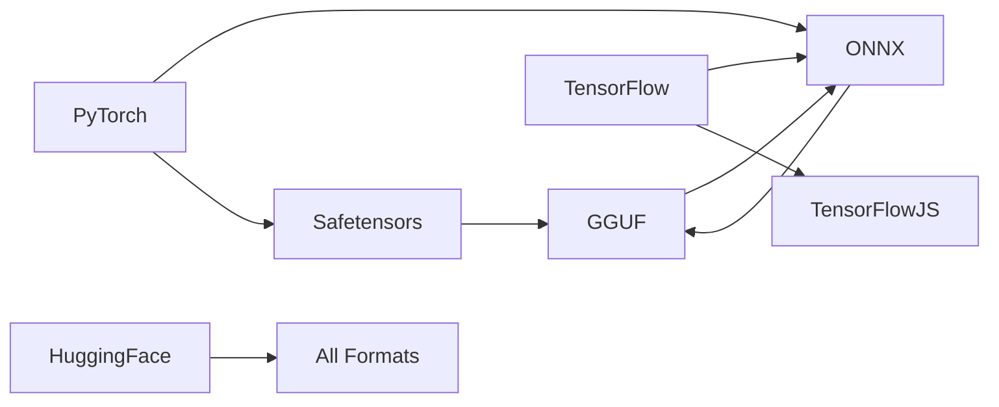

# 📦 Model Formats Guide - Understanding Neural Containers

*Every format tells a story, every specification opens a door to new possibilities*

## Table of Contents
- [Format Overview](#format-overview)
- [GGUF/GGML Format](#ggufggml-format)
- [ONNX Format](#onnx-format)
- [Safetensors Format](#safetensors-format)
- [HuggingFace Format](#huggingface-format)
- [TensorFlow.js Format](#tensorflowjs-format)
- [Custom Formats](#custom-formats)
- [Format Conversion](#format-conversion)
- [Performance Comparison](#performance-comparison)

## Format Overview

### The Neural Babel Fish

Different model formats exist for different reasons - optimization, compatibility, security, or sheer historical accident. LLM-Runner-Router speaks them all fluently.

```javascript
// The system automatically detects and loads any format
const model = await router.load('model.gguf');    // Quantized
const model2 = await router.load('model.onnx');   // Cross-platform
const model3 = await router.load('model.safetensors'); // Secure
const model4 = await router.load('hf:gpt2');      // HuggingFace
```

### Format Comparison Matrix

| Format | Size | Speed | Compatibility | Quantization | Security |
|--------|------|-------|---------------|--------------|----------|
| GGUF | ⭐⭐⭐⭐⭐ | ⭐⭐⭐⭐ | ⭐⭐⭐ | ⭐⭐⭐⭐⭐ | ⭐⭐⭐ |
| ONNX | ⭐⭐⭐ | ⭐⭐⭐⭐⭐ | ⭐⭐⭐⭐⭐ | ⭐⭐⭐ | ⭐⭐⭐⭐ |
| Safetensors | ⭐⭐⭐⭐ | ⭐⭐⭐⭐ | ⭐⭐⭐⭐ | ⭐⭐ | ⭐⭐⭐⭐⭐ |
| HuggingFace | ⭐⭐ | ⭐⭐⭐ | ⭐⭐⭐⭐⭐ | ⭐⭐ | ⭐⭐⭐⭐ |
| TensorFlow.js | ⭐⭐⭐ | ⭐⭐⭐ | ⭐⭐⭐⭐ | ⭐⭐ | ⭐⭐⭐ |

## GGUF/GGML Format

### The Quantization Champions

GGUF (GPT-Generated Unified Format) and its predecessor GGML are the go-to formats for quantized models that run efficiently on consumer hardware.

### File Structure

```
GGUF File Layout:
┌─────────────────────────┐
│     Magic Number        │ "GGUF"
├─────────────────────────┤
│     Version (u32)       │ Currently 3
├─────────────────────────┤
│    Metadata Count       │
├─────────────────────────┤
│     Metadata KV         │ Architecture, parameters, etc.
├─────────────────────────┤
│    Tensor Count         │
├─────────────────────────┤
│    Tensor Metadata      │ Names, shapes, types
├─────────────────────────┤
│    Alignment Padding    │
├─────────────────────────┤
│     Tensor Data         │ The actual weights
└─────────────────────────┘
```

### Loading GGUF Models

```javascript
// Simple loading
const model = await router.load('llama-7b-q4_k_m.gguf');

// With configuration
const model = await router.load({
  source: 'models/llama-7b.gguf',
  format: 'gguf',
  config: {
    contextSize: 4096,
    gpuLayers: 35,
    threads: 8,
    batchSize: 512
  }
});
```

### Quantization Levels

```javascript
const quantizationTypes = {
  'q2_k': { bits: 2.5625, quality: '⭐⭐', size: '⭐⭐⭐⭐⭐' },
  'q3_k_s': { bits: 2.75, quality: '⭐⭐', size: '⭐⭐⭐⭐⭐' },
  'q3_k_m': { bits: 3.0625, quality: '⭐⭐⭐', size: '⭐⭐⭐⭐' },
  'q3_k_l': { bits: 3.5625, quality: '⭐⭐⭐', size: '⭐⭐⭐⭐' },
  'q4_0': { bits: 4.0, quality: '⭐⭐⭐', size: '⭐⭐⭐⭐' },
  'q4_1': { bits: 4.5, quality: '⭐⭐⭐', size: '⭐⭐⭐' },
  'q4_k_s': { bits: 4.25, quality: '⭐⭐⭐⭐', size: '⭐⭐⭐⭐' },
  'q4_k_m': { bits: 4.5625, quality: '⭐⭐⭐⭐', size: '⭐⭐⭐' },
  'q5_0': { bits: 5.0, quality: '⭐⭐⭐⭐', size: '⭐⭐⭐' },
  'q5_1': { bits: 5.5, quality: '⭐⭐⭐⭐', size: '⭐⭐⭐' },
  'q5_k_s': { bits: 5.25, quality: '⭐⭐⭐⭐', size: '⭐⭐⭐' },
  'q5_k_m': { bits: 5.6875, quality: '⭐⭐⭐⭐⭐', size: '⭐⭐' },
  'q6_k': { bits: 6.5625, quality: '⭐⭐⭐⭐⭐', size: '⭐⭐' },
  'q8_0': { bits: 8.0, quality: '⭐⭐⭐⭐⭐', size: '⭐' },
  'f16': { bits: 16.0, quality: '⭐⭐⭐⭐⭐', size: '⭐' },
  'f32': { bits: 32.0, quality: '⭐⭐⭐⭐⭐', size: '⭐' }
};
```

### GGUF Metadata

```javascript
// Accessing model metadata
const metadata = model.metadata;
console.log({
  architecture: metadata['general.architecture'],
  parameters: metadata['llama.param_count'],
  context: metadata['llama.context_length'],
  embeddingLength: metadata['llama.embedding_length'],
  layers: metadata['llama.block_count'],
  quantization: metadata['general.quantization_version']
});
```

## ONNX Format

### The Universal Translator

ONNX (Open Neural Network Exchange) enables models to run across different frameworks and platforms.

### Structure

```javascript
// ONNX model structure
{
  graph: {
    nodes: [...],      // Operations
    initializers: [...], // Weights
    inputs: [...],     // Input tensors
    outputs: [...]     // Output tensors
  },
  opsetImports: [...], // Operation set versions
  metadata: {...}      // Model information
}
```

### Loading ONNX Models

```javascript
// Load ONNX model
const model = await router.load({
  source: 'model.onnx',
  format: 'onnx',
  config: {
    executionProviders: ['webgpu', 'wasm'], // Priority order
    graphOptimizationLevel: 'all',
    enableProfiling: false
  }
});
```

### ONNX Runtime Providers

```javascript
const providers = {
  'cpu': { speed: '⭐⭐', compatibility: '⭐⭐⭐⭐⭐' },
  'cuda': { speed: '⭐⭐⭐⭐⭐', compatibility: '⭐⭐' },
  'webgpu': { speed: '⭐⭐⭐⭐', compatibility: '⭐⭐⭐' },
  'wasm': { speed: '⭐⭐⭐', compatibility: '⭐⭐⭐⭐⭐' },
  'coreml': { speed: '⭐⭐⭐⭐', compatibility: '⭐' }
};
```

## Safetensors Format

### The Security-First Format

Safetensors provides a simple, safe way to store and distribute tensors, preventing arbitrary code execution.

### File Format

```python
# Safetensors structure
{
  "__metadata__": {
    "format": "pt",
    "model_type": "llama",
    "quantization": "none"
  },
  "model.embed_tokens.weight": {
    "dtype": "F32",
    "shape": [32000, 4096],
    "data_offsets": [0, 524288000]
  }
  # ... more tensors
}
```

### Loading Safetensors

```javascript
const model = await router.load({
  source: 'model.safetensors',
  format: 'safetensors',
  config: {
    validateChecksum: true,
    lazyLoad: true, // Load tensors on demand
    memoryMap: true  // Use memory mapping
  }
});
```

### Security Features

```javascript
// Safetensors security
const security = {
  noCodeExecution: true,     // No pickle exploits
  checksumValidation: true,  // Data integrity
  typeSafety: true,          // Strong typing
  deterministicLoading: true // Predictable behavior
};
```

## HuggingFace Format

### The Democratic Model Hub

HuggingFace provides a unified interface to thousands of pre-trained models.

### Loading from HuggingFace

```javascript
// Direct from HuggingFace
const model = await router.load('huggingface:gpt2');

// With specific revision
const model = await router.load({
  source: 'huggingface:meta-llama/Llama-2-7b-hf',
  revision: 'main',
  authToken: process.env.HF_TOKEN // For gated models
});
```

### Model Card Integration

```javascript
// Access model card information
const modelCard = await model.getModelCard();
console.log({
  description: modelCard.description,
  intendedUse: modelCard.intendedUse,
  limitations: modelCard.limitations,
  trainingData: modelCard.trainingData,
  evaluationData: modelCard.evaluationData
});
```

## TensorFlow.js Format

### Browser-Native Neural Networks

TensorFlow.js models run directly in the browser without any backend.

### Model Structure

```javascript
// TensorFlow.js model files
model.json         // Architecture and metadata
group1-shard1of4   // Weight chunks
group1-shard2of4
group1-shard3of4
group1-shard4of4
```

### Loading TensorFlow.js Models

```javascript
const model = await router.load({
  source: 'https://tfhub.dev/model/1/model.json',
  format: 'tensorflowjs',
  config: {
    backend: 'webgl', // or 'wasm', 'cpu'
    precision: 'float32'
  }
});
```

## Custom Formats

### Bring Your Own Format

LLM-Runner-Router supports custom format loaders for proprietary or experimental formats.

### Creating a Custom Loader

```javascript
class MyCustomLoader {
  static format = 'myformat';
  static extensions = ['.mymodel'];
  
  async canLoad(path) {
    return path.endsWith('.mymodel');
  }
  
  async load(spec) {
    // Load your custom format
    const data = await this.readCustomFormat(spec.source);
    
    // Create model instance
    return new MyCustomModel({
      ...data,
      format: 'myformat'
    });
  }
  
  async validate(model) {
    // Validate model integrity
    return true;
  }
}

// Register the loader
router.registry.registerLoader('myformat', new MyCustomLoader());
```

### Custom Model Implementation

```javascript
class MyCustomModel extends ModelInterface {
  async generate(prompt, options) {
    // Your inference logic
  }
  
  async tokenize(text) {
    // Your tokenization
  }
  
  async detokenize(tokens) {
    // Your detokenization
  }
}
```

## Format Conversion

### Converting Between Formats

```javascript
// Convert GGUF to ONNX
const converter = new FormatConverter();
await converter.convert({
  input: 'model.gguf',
  output: 'model.onnx',
  targetFormat: 'onnx',
  optimization: 'speed'
});
```

### Conversion Matrix



### Quantization Pipeline

```javascript
// Quantize any model
const quantizer = new Quantizer();
const quantized = await quantizer.quantize(model, {
  method: 'dynamic',
  bits: 4,
  strategy: 'symmetric',
  calibrationData: trainingData
});
```

## Performance Comparison

### Format Benchmarks

```javascript
const benchmarks = {
  'GGUF q4_k_m': {
    loadTime: '0.5s',
    firstToken: '50ms',
    tokensPerSec: 30,
    memoryUsage: '4GB'
  },
  'ONNX fp16': {
    loadTime: '1.2s',
    firstToken: '30ms',
    tokensPerSec: 45,
    memoryUsage: '8GB'
  },
  'Safetensors': {
    loadTime: '0.8s',
    firstToken: '60ms',
    tokensPerSec: 25,
    memoryUsage: '6GB'
  },
  'TensorFlow.js': {
    loadTime: '2.0s',
    firstToken: '100ms',
    tokensPerSec: 20,
    memoryUsage: '5GB'
  }
};
```

### Choosing the Right Format

```javascript
function selectFormat(requirements) {
  if (requirements.size === 'critical') {
    return 'gguf-q4'; // Maximum compression
  }
  if (requirements.compatibility === 'universal') {
    return 'onnx'; // Runs everywhere
  }
  if (requirements.security === 'paranoid') {
    return 'safetensors'; // No code execution
  }
  if (requirements.ecosystem === 'huggingface') {
    return 'hf'; // Best integration
  }
  if (requirements.platform === 'browser') {
    return 'tfjs'; // Browser native
  }
  return 'gguf-q5'; // Balanced default
}
```

## Format-Specific Optimizations

### GGUF Optimizations

```javascript
// GGUF-specific settings
{
  mmap: true,           // Memory-mapped loading
  mlock: true,          // Lock in RAM
  gpuLayers: 35,        // Offload to GPU
  mainGpu: 0,           // Primary GPU
  tensorSplit: [0.7, 0.3], // Multi-GPU split
  threads: 8,           // CPU threads
  batchSize: 512        // Processing batch
}
```

### ONNX Optimizations

```javascript
// ONNX-specific settings
{
  graphOptimization: 'extended',
  executionMode: 'parallel',
  memoryPattern: 'sequential',
  enableCpuMemArena: true,
  interOpNumThreads: 4,
  intraOpNumThreads: 8
}
```

## Troubleshooting Format Issues

### Common Problems and Solutions

| Problem | Possible Cause | Solution |
|---------|---------------|----------|
| "Invalid magic number" | Wrong format | Check file header |
| "Unsupported quantization" | Old format version | Update converter |
| "Tensor shape mismatch" | Corrupted file | Re-download model |
| "Out of memory" | Model too large | Use quantization |
| "Slow loading" | No memory mapping | Enable mmap |

### Format Validation

```javascript
// Validate model file
const validator = new FormatValidator();
const result = await validator.validate('model.gguf');

if (!result.valid) {
  console.error('Validation failed:', result.errors);
}
```

---

*Every format has its place in the neural ecosystem. Choose wisely, convert freely, run everywhere!* 🚀

Built with 💙 by Echo AI Systems
