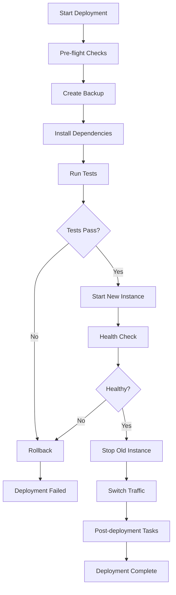

# LLM-Runner-Router Autonomous Operations Guide

## 🤖 Complete Autonomous Setup & Management

This guide provides comprehensive instructions for autonomous installation, deployment, monitoring, and management of the LLM-Runner-Router system.

## 🚀 Quick Start (One-Command Setup)

For completely autonomous setup on any system:

```bash
curl -fsSL https://raw.githubusercontent.com/MCERQUA/LLM-Runner-Router/main/setup.sh | bash
```

Or clone and run locally:

```bash
git clone https://github.com/MCERQUA/LLM-Runner-Router.git
cd LLM-Runner-Router
chmod +x setup.sh
./setup.sh
```

## 📋 Autonomous Scripts Overview

### 1. Main Setup Script
- **File**: `setup.sh`
- **Purpose**: Complete autonomous installation and configuration
- **Features**:
  - System detection (Linux/macOS, VPS/local)
  - Dependency installation (Node.js, npm, git)
  - Environment configuration
  - Security setup (automatic secret generation)
  - Build and validation
  - Service configuration (systemd on Linux)

### 2. Environment Manager
- **File**: `scripts/env-manager.sh`
- **Purpose**: Environment configuration management
- **Commands**:
  ```bash
  ./scripts/env-manager.sh show                    # Show current environment
  ./scripts/env-manager.sh switch production       # Switch environment
  ./scripts/env-manager.sh validate                # Validate configuration
  ./scripts/env-manager.sh security                # Security audit
  ./scripts/env-manager.sh generate-secrets        # Generate secure secrets
  ```

### 3. Deployment Automation
- **File**: `scripts/deploy.sh`
- **Purpose**: Zero-downtime production deployment
- **Usage**:
  ```bash
  ./scripts/deploy.sh production 3000    # Deploy to production
  ./scripts/deploy.sh staging 3001       # Deploy to staging
  ```

### 4. Monitoring & Health Checks
- **File**: `scripts/monitor.sh`
- **Purpose**: Comprehensive system monitoring
- **Commands**:
  ```bash
  ./scripts/monitor.sh start      # Start service
  ./scripts/monitor.sh stop       # Stop service
  ./scripts/monitor.sh status     # Detailed status
  ./scripts/monitor.sh monitor    # Continuous monitoring
  ./scripts/monitor.sh health     # Single health check
  ```

### 5. Autonomous Updates
- **File**: `scripts/autonomous-update.sh`
- **Purpose**: Safe dependency updates with rollback
- **Features**:
  - Automatic backup creation
  - Security vulnerability fixes
  - Validation testing
  - Automatic rollback on failure

## 🔧 Environment Configurations

### Available Environments

| Environment | File | Purpose | Port | Features |
|-------------|------|---------|------|----------|
| Development | `.env.example` | Local development | 3000 | Debug logging, test endpoints |
| Staging | `.env.staging` | Testing/preview | 3001 | Production-like, more logging |
| Production | `.env.production` | Live deployment | 3000 | Optimized, secure, minimal logging |
| VPS | `.env.vps` | VPS-optimized | 3000 | Resource-constrained optimization |

### Automatic Environment Detection

The setup script automatically detects:
- **Operating System**: Linux (Debian/RHEL), macOS
- **Environment Type**: VPS (virtualized) vs Local
- **Resource Constraints**: CPU cores, memory limits
- **Available Tools**: Node.js version, package managers

### Security Features

1. **Automatic Secret Generation**:
   ```bash
   # Generates secure secrets automatically
   SESSION_SECRET=$(openssl rand -hex 32)
   API_KEYS=$(openssl rand -hex 32)
   ```

2. **Security Validation**:
   - Checks for weak/default passwords
   - Validates production configurations
   - CORS origin validation
   - API key strength verification

## 🏗️ Deployment Strategies

### Zero-Downtime Deployment

The deployment script implements sophisticated zero-downtime strategies:

1. **Health Check Validation**: Ensures new instance is healthy before switching
2. **Graceful Shutdown**: Properly closes existing connections
3. **Rollback Capability**: Automatic rollback on deployment failure
4. **Backup Management**: Maintains deployment history and rollback points

### Deployment Process Flow



## 📊 Monitoring & Alerting

### Automatic Monitoring Features

1. **Health Checks**:
   - HTTP endpoint monitoring (`/api/health`)
   - Memory usage tracking
   - CPU utilization monitoring
   - Disk space verification

2. **Auto-Recovery**:
   - Service restart on failure
   - Memory limit enforcement
   - Failure threshold management
   - Cooldown periods

3. **Alerting**:
   - Webhook notifications
   - Log-based alerts
   - Performance threshold alerts
   - Security incident notifications

### Monitoring Configuration

```bash
# Monitor configuration
CHECK_INTERVAL=30           # Health check every 30 seconds
MAX_MEMORY_MB=1536         # 1.5GB memory limit
MAX_CPU_PERCENT=80         # 80% CPU threshold
MAX_FAILURES=3             # Max failures before restart
RESTART_COOLDOWN=300       # 5-minute restart cooldown
```

## 🔄 Autonomous Operations Workflows

### 1. Daily Operations

Automated daily tasks:
- Health status reports
- Log rotation
- Memory usage optimization
- Security audit checks
- Backup verification

### 2. Weekly Maintenance

Automated weekly tasks:
- Dependency updates (security only)
- Performance benchmarking
- Resource usage analysis
- Configuration validation
- Cleanup old logs/backups

### 3. Emergency Response

Automatic emergency procedures:
- Service crash recovery
- Memory leak detection
- High CPU usage mitigation
- Disk space cleanup
- Security incident response

## 📱 Service Management

### Systemd Service (Linux VPS)

Automatic systemd service installation:

```bash
# Service management
sudo systemctl start llm-router      # Start service
sudo systemctl stop llm-router       # Stop service
sudo systemctl restart llm-router    # Restart service
sudo systemctl status llm-router     # Check status
sudo systemctl enable llm-router     # Enable auto-start

# View logs
sudo journalctl -u llm-router -f     # Follow logs
sudo journalctl -u llm-router --since "1 hour ago"  # Recent logs
```

### Manual Service Management

Alternative control scripts:

```bash
# Manual control
./start.sh                # Start with monitoring
./stop.sh                 # Clean shutdown
./scripts/monitor.sh monitor  # Start monitoring loop
```

## 🔐 Security Best Practices

### Automatic Security Configuration

1. **Secret Management**:
   - Auto-generated secure secrets
   - Environment-specific API keys
   - Secure session configurations

2. **Access Control**:
   - CORS origin validation
   - Rate limiting configuration
   - API key authentication

3. **Security Monitoring**:
   - Failed authentication tracking
   - Unusual usage pattern detection
   - Security configuration validation

### Security Audit Commands

```bash
# Security validation
./scripts/env-manager.sh security              # Audit current config
./scripts/env-manager.sh security .env.production  # Audit production
./scripts/env-manager.sh validate              # Full validation
```

## 🚨 Troubleshooting & Recovery

### Common Issues & Auto-Resolution

1. **Service Won't Start**:
   - Automatic port conflict detection
   - Dependency verification
   - Configuration validation
   - Resource availability check

2. **High Memory Usage**:
   - Automatic memory monitoring
   - Garbage collection tuning
   - Model unloading strategies
   - Memory leak detection

3. **Performance Issues**:
   - CPU usage optimization
   - Connection pool management
   - Cache optimization
   - Request throttling

### Recovery Procedures

```bash
# Emergency recovery
./scripts/monitor.sh status           # Check system status
./scripts/autonomous-update.sh        # Safe update with rollback
./scripts/deploy.sh production        # Redeploy from known good state

# Manual intervention
pkill -f "node.*server.js"           # Force stop
rm -f llm-router.pid                 # Clean PID file
./start.sh                           # Fresh start
```

## 📈 Performance Optimization

### VPS-Specific Optimizations

Automatic optimizations for VPS environments:

1. **Resource Management**:
   - CPU thread limiting
   - Memory usage caps
   - Batch size optimization
   - Connection limits

2. **Model Management**:
   - Lazy loading strategies
   - Simple fallback models
   - Model unloading policies
   - Context size optimization

3. **Caching Strategies**:
   - Extended cache TTL
   - Response compression
   - Static file caching
   - Query optimization

## 🔄 Maintenance Schedules

### Automated Maintenance

The system includes automated maintenance tasks:

```bash
# Daily (2 AM)
0 2 * * * /path/to/scripts/daily-maintenance.sh

# Weekly (Sunday 3 AM)
0 3 * * 0 /path/to/scripts/weekly-maintenance.sh

# Monthly (1st day 4 AM)
0 4 1 * * /path/to/scripts/monthly-maintenance.sh
```

### Manual Maintenance

```bash
# Update dependencies safely
./scripts/autonomous-update.sh

# Clean up resources
./scripts/cleanup.sh

# Generate performance report
./scripts/performance-report.sh

# Backup configurations
./scripts/env-manager.sh backup
```

## 📞 Support & Monitoring

### Health Check Endpoints

```bash
# Application health
curl http://localhost:3000/api/health

# Detailed status
curl http://localhost:3000/api/status

# Metrics (if enabled)
curl http://localhost:3000/metrics
```

### Log Files

```bash
# Application logs
tail -f server.log

# System logs
tail -f monitoring.log

# Error logs
tail -f alerts.log

# Access logs
tail -f access.log
```

### Remote Monitoring

Set up webhook notifications:

```bash
# Configure webhook in environment
WEBHOOK_URL=https://your-monitoring-service.com/webhook
WEBHOOK_SECRET=your-webhook-secret

# Test webhook
curl -X POST $WEBHOOK_URL \
  -H "Content-Type: application/json" \
  -d '{"level":"test","service":"llm-router","message":"Test notification"}'
```

## 🎯 Best Practices Summary

1. **Always run setup script on new systems**
2. **Use environment manager for configuration changes**
3. **Test deployments in staging before production**
4. **Monitor health checks regularly**
5. **Keep backups of working configurations**
6. **Update dependencies with autonomous update script**
7. **Review security audits periodically**
8. **Use systemd service for production VPS**
9. **Configure webhook monitoring for alerts**
10. **Follow zero-downtime deployment practices**

---

## 📚 Additional Resources

- **Main Documentation**: `/docs/README.md`
- **API Reference**: `http://localhost:3000/docs.html`
- **Configuration Guide**: `docs/CONFIG_REFERENCE.md`
- **Troubleshooting**: `docs/TROUBLESHOOTING.md`
- **Security Guide**: `docs/SECURITY.md`

For support: https://github.com/MCERQUA/LLM-Runner-Router/issues

---

**Generated**: 2025-01-20
**Version**: 2.0.0
**Status**: Production Ready with Full Autonomous Operation Support